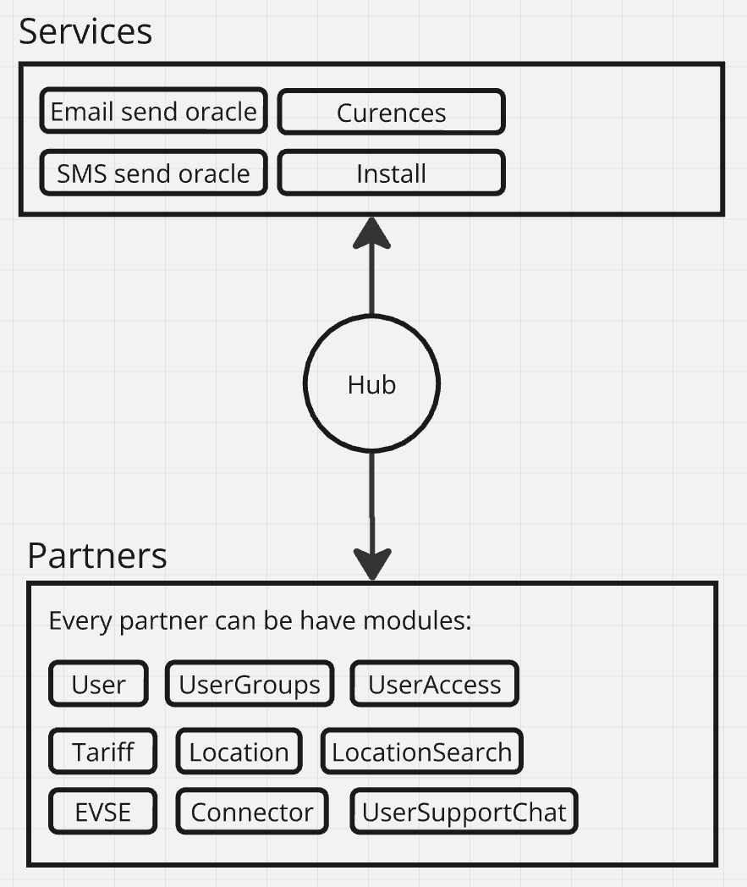

# Введение

Задача всего проекта - это предоставить возможность рынку зарядной инфраструктуры использовать ПО которое: экономически выгодное в использовании, отказоустоичивое, быстро разворачиваемое, свободное в распространении.

Основная цель - использовать по максимуму технологию Web3, а именно: EVM + IPFS. Где EVM выступает как программируема БД, а IPFS как фаиловое хранилище.

Точкой входа в сервис является контракт Hub, он ведет учет партнеров в экосистеме, по нему можно определить что в систему добавился новый игрок, какие у него реализованы модули, какую роль он выполняет в системе.

### Offchain

Есть ряд сервисов которые невозможно полноценно запустить на блокчейне, поэтому они реализованы в виде оракулов, это:

1) Сервис отправки смс сообщений
2) Сервис отправки Email сообщений
3) Инсталл сервис - отвечает за регистрацию пользователей в Web3.
4) Валютный сервис - хранит информацию о всех валютах мира и их курсе.

Все эти сервисы на себя берет система которой предлагается доверять.

Принципиальная схема на данный момент:

## Модули

1) [Hub](./Hub.md)
